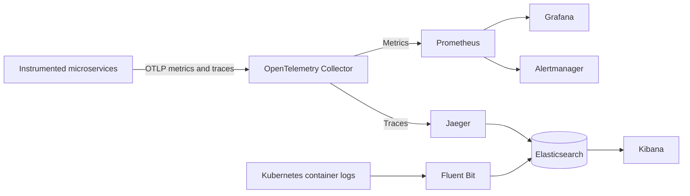

# Kubernetes Observability Platform on AWS EKS

I designed and implemented an end-to-end observability platform for containerized microservices running on Amazon EKS. The project brings metrics, logs, traces, dashboards, and alerting into one environment using open-source, cloud-native tools.

The repository contains the Kubernetes manifests, Helm values, instrumented services, alert rules, and load-generation scripts I used to build and validate the platform.

> [!IMPORTANT]
> This project provisions AWS infrastructure and may incur charges. Review the cleanup instructions before deploying it and remove resources when they are no longer required.

## Project overview

The goal was to create a practical observability environment capable of answering three operational questions:

- **Metrics:** Is the platform healthy, and where is performance degrading?
- **Logs:** What happened inside the applications or cluster?
- **Traces:** Where did a request spend time as it moved between services?

To address these questions, I built the platform around Prometheus and Grafana for monitoring, Elasticsearch and Kibana for data exploration, Fluent Bit for log forwarding, Jaeger for distributed tracing, Alertmanager for notifications, and OpenTelemetry for vendor-neutral instrumentation and telemetry collection.

## Architecture



The project was implemented incrementally. The monitoring, logging, and tracing components can be deployed independently, while the final implementation connects the instrumented Go services to the OpenTelemetry Collector for centralized metrics and trace processing.

## What I implemented

- Provisioned an Amazon EKS cluster and configured the AWS EBS CSI driver for persistent workloads.
- Deployed Prometheus, Grafana, and Alertmanager with Helm.
- Created PromQL queries and alert rules for CPU usage and container restarts.
- Configured `ServiceMonitor` resources to discover and scrape application metrics.
- Instrumented Node.js and Go microservices with custom request counters, duration histograms, active-request gauges, and distributed tracing.
- Propagated trace context across service-to-service HTTP calls with OpenTelemetry.
- Deployed the OpenTelemetry Collector to receive OTLP telemetry and export metrics to Prometheus and traces to Jaeger.
- Built an Elasticsearch, Fluent Bit, and Kibana pipeline for centralized Kubernetes logging.
- Configured Jaeger to use Elasticsearch for persistent trace storage.
- Added scripts that generate application traffic to validate metrics and distributed traces.
- Documented resource cleanup to limit unnecessary AWS costs.

## Technology stack

| Area | Technologies |
| --- | --- |
| Cloud platform | AWS, Amazon EKS, IAM, Amazon EBS |
| Container orchestration | Kubernetes, Helm, Kustomize |
| Metrics and dashboards | Prometheus, PromQL, Grafana |
| Alerting | PrometheusRule, Alertmanager |
| Logging | Fluent Bit, Elasticsearch, Kibana |
| Distributed tracing | Jaeger, OpenTelemetry |
| Applications | Go, Gin, Node.js, Express |
| Packaging and testing | Docker, Bash, `curl` |

## Implementation breakdown

The `day-*` directories reflect the stages in which I developed and documented the project:

| Stage | Implementation | Details |
| --- | --- | --- |
| [Stage 1](day-1/readme.md) | Requirements and observability model | Defined the distinction between monitoring and observability and mapped the metrics, logs, and traces required by the platform. |
| [Stage 2](day-2/readme.md) | Cluster monitoring | Provisioned EKS and deployed `kube-prometheus-stack` for Prometheus, Grafana, and Alertmanager. |
| [Stage 3](day-3/readme.md) | Metric analysis | Developed PromQL queries and added ingress configuration for the monitoring stack. |
| [Stage 4](day-4/readme.md) | Application metrics and alerts | Deployed instrumented services, configured Prometheus service discovery, and created alerting rules. |
| [Stage 5](day-5/readme.md) | Centralized logging | Deployed Elasticsearch, Fluent Bit, and Kibana to collect and explore Kubernetes logs. |
| [Stage 6](day-6/readme.md) | Distributed tracing | Deployed Jaeger, connected it to Elasticsearch, and validated traces across the services. |
| [Stage 7](day-7/README.md) | OpenTelemetry integration | Built and deployed two instrumented Go services and routed their metrics and traces through the OpenTelemetry Collector. |

## Repository structure

```text
.
├── day-1/              # Requirements and observability concepts
├── day-2/              # EKS monitoring stack and Helm values
├── day-3/              # PromQL examples and ingress configuration
├── day-4/              # Application manifests, ServiceMonitor, and alerts
├── day-5/              # EFK logging configuration
├── day-6/              # Jaeger configuration
├── day-7/              # OpenTelemetry Collector and Go microservices
└── opensearch-stack/   # Supplementary OpenSearch and Fluent Bit manifests
```

## Deployment prerequisites

Reproducing the project requires:

- An AWS account with permission to create EKS, IAM, EC2, load balancer, and EBS resources.
- A configured [AWS CLI](https://docs.aws.amazon.com/cli/latest/userguide/getting-started-install.html).
- [`eksctl`](https://eksctl.io/installation/), [`kubectl`](https://kubernetes.io/docs/tasks/tools/), and [Helm](https://helm.sh/docs/intro/install/).
- Docker and access to a container registry.
- Git, `curl`, and a Bash-compatible shell.

## Reproducing the project

Clone the repository:

```bash
git clone https://github.com/pilotgab/observability-zero-to-hero.git
cd observability-zero-to-hero
```

The implementation notes are organized in dependency order. Start with [Stage 2](day-2/readme.md) to create the EKS cluster and monitoring stack, then continue through the remaining stages for application metrics, logging, tracing, and OpenTelemetry integration.

Before deploying:

1. Replace all placeholder image names, endpoints, email addresses, and credentials.
2. Store sensitive values in Kubernetes Secrets or an external secrets manager; do not commit them to source control.
3. Confirm that `kubectl` is targeting the intended cluster:

   ```bash
   kubectl config current-context
   ```

4. Review the Helm values and Kubernetes manifests for environment-specific settings such as storage classes, namespaces, resource limits, and service types.

## Validation

I validated the platform by generating traffic between the two sample microservices and confirming that:

- Application and Kubernetes metrics were available in Prometheus.
- Dashboards could be created from the collected metrics in Grafana.
- Configured alert rules appeared in Prometheus and were routed through Alertmanager.
- Container logs were searchable in Kibana.
- End-to-end request traces and service dependencies were visible in Jaeger.
- The OpenTelemetry Collector received and exported application telemetry successfully.

The load-generation scripts in `day-4/` and `day-7/` can be used to reproduce this validation after deployment.

## Production considerations

This is a portfolio and lab implementation, not a production-ready platform. A production deployment should additionally address high availability, authentication and authorization, network policies, secret rotation, encrypted storage, retention policies, backup and recovery, resource sizing, autoscaling, and pinned chart and container versions.

## Cleanup

Each implementation guide includes commands for removing its Kubernetes and Helm resources. After deleting the EKS cluster, check the AWS console for remaining load balancers, EBS volumes, or other billable resources.
